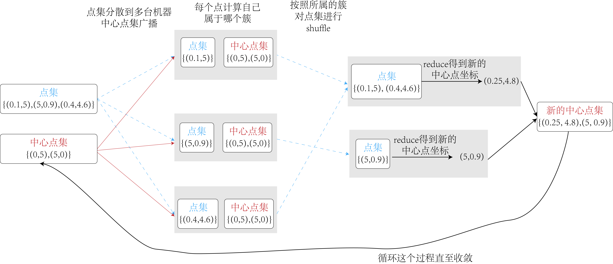

### 使用flink实现一个分布式的kmeans算法

> kmeans算法是一个经典的机器学习聚类算法，给定一个点集和簇的数量k，我们先随机生成k个中心点，然后逐渐
> 通过更新中心点坐标来确定每个节点属于哪个簇。
> 

在分布式环境中，点集是分布在多台机器上的，我们将中心点集广播到所有机器上，每个机器收到中心点集之后，
其上的每个点确定自己属于哪个簇，然后我们进行一次shuffle，将属于相同簇的点集分布到一台机器上，然后进行reduce
得到新的中心点。

循环这个过程直到中心点收敛或者达到了我们指定的最大循环数量。

